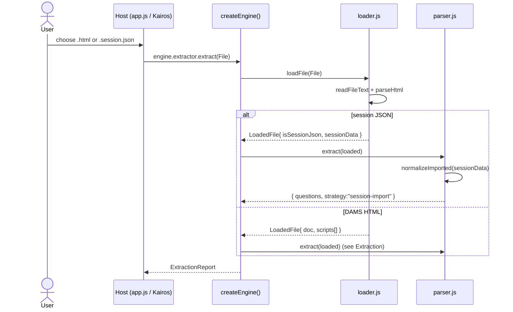
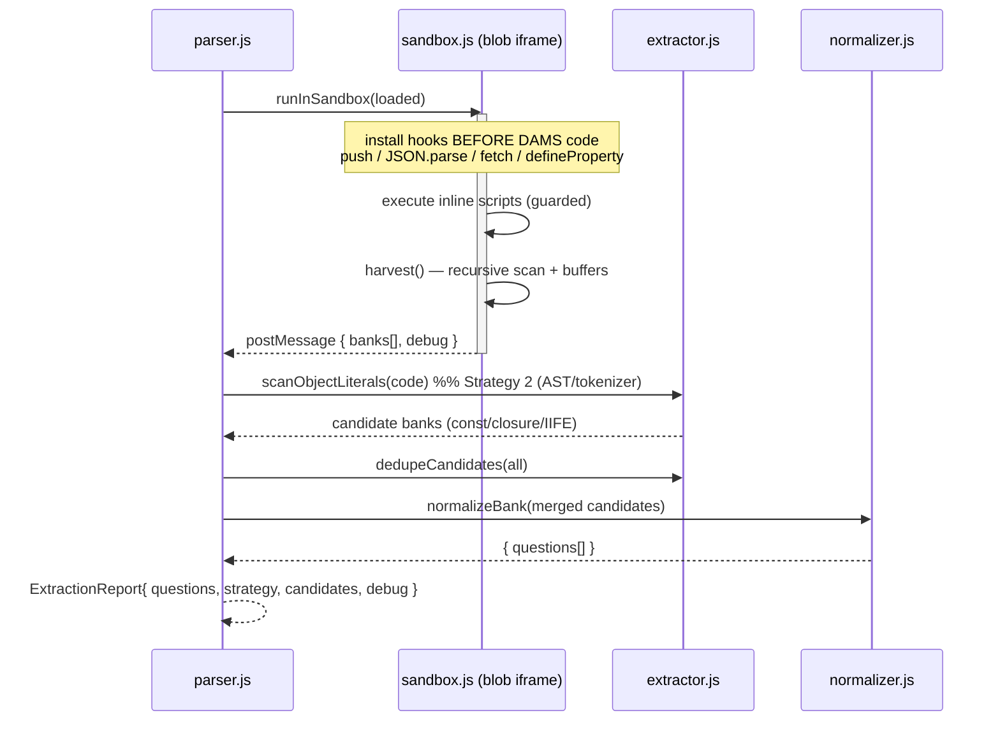
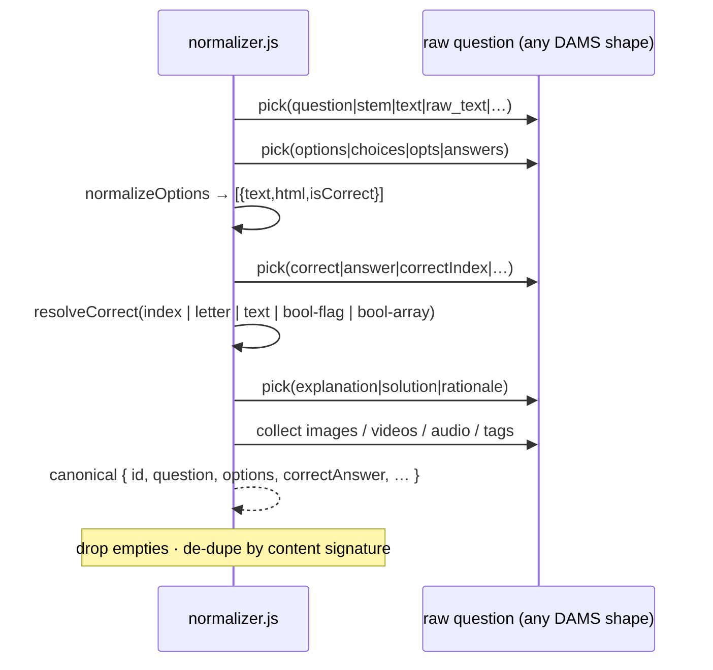
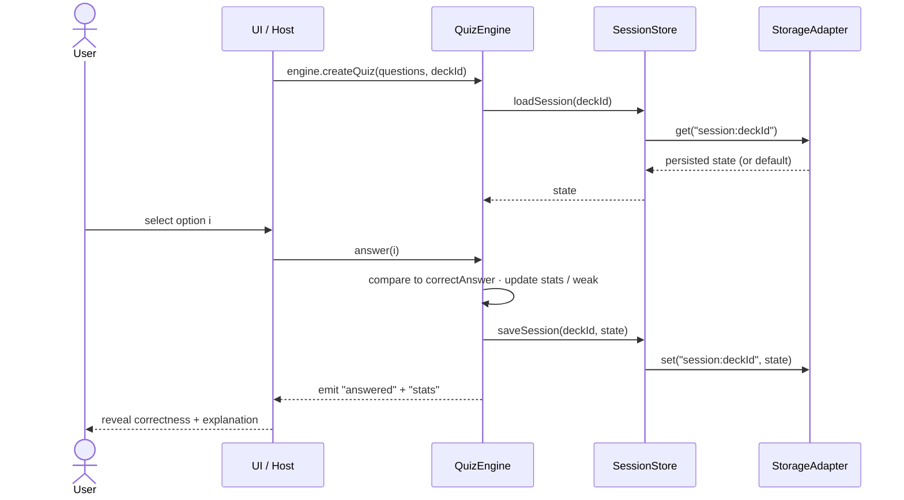
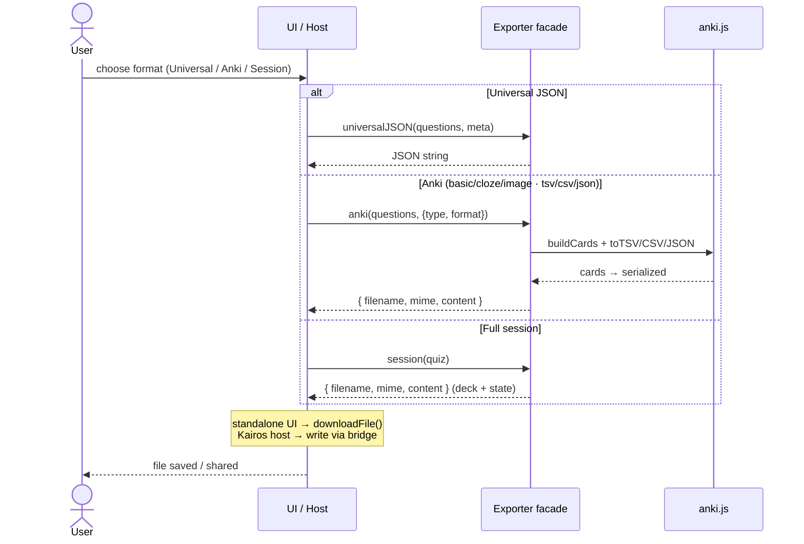

# Sequence Diagrams

Interaction flows across the subsystems. Rendered by GitHub; the raw `.mmd`
sources are in `docs/diagrams/` for other tooling.

---

## 1. Import (file / session in)

---

## 2. Extraction (ten strategies)

---

## 3. Normalization (per question)

---

## 4. Quiz (answer a question)

---

## 5. Export (deck / session out)

